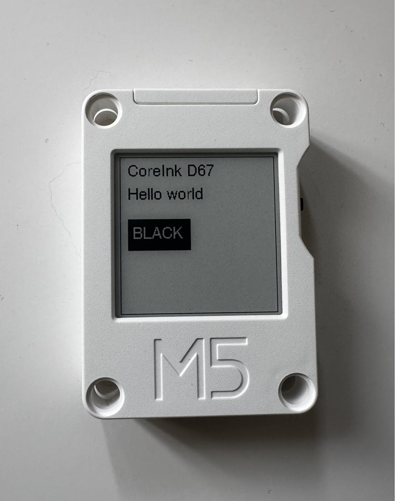
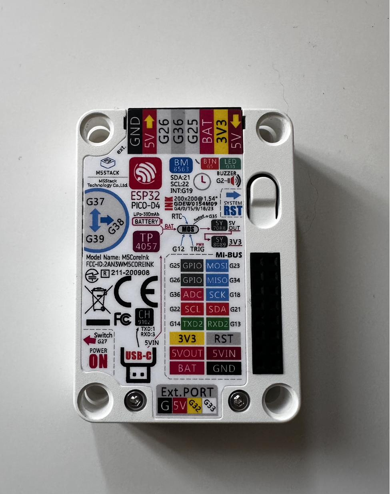
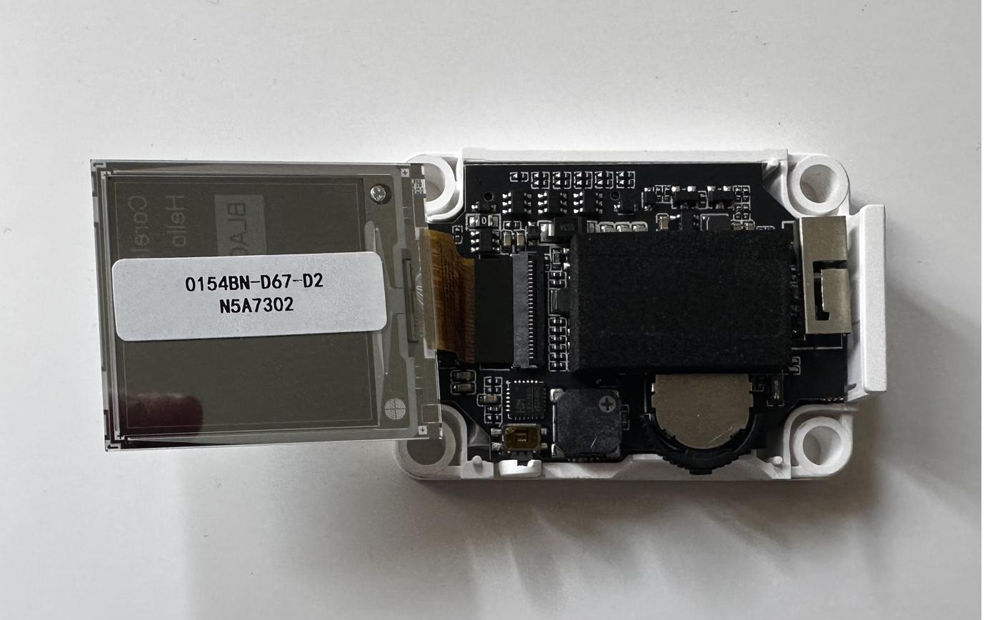

# Hardware Notes

## Confirmed Unit

- Device: M5Stack CoreInk
- ESPHome node used during discovery: `m5stack-core-ink-kitchen`
- Confirmed panel marking after removing the back: `0154BN-D67-D2`
- Likely public panel family: Good Display `GDEY0154D67`
- Likely controller: `SSD1681`
- Resolution: `200x200`
- Interface: SPI
- Color: black and white

## Photos

**Display rendering** — front of assembled CoreInk running the minimal example:



**Back label** — board silk screen reads `GDEW0154M09` but the installed panel is the D67 variant:



**Panel marking** — back cover removed, `0154BN-D67-D2` label visible on the panel:



## CoreInk Pins

Known working board wiring from the existing ESPHome notes:

| Function | GPIO | Notes |
|---|---:|---|
| SPI CLK | GPIO18 | ESP32 VSPI clock |
| SPI MOSI | GPIO23 | ESP32 VSPI MOSI |
| Display CS | GPIO9 | Explicit in YAML for now |
| Display DC | GPIO15 | Defaulted by this component |
| Display BUSY | GPIO4 | Non-inverted during workaround testing |
| Power hold | GPIO12 | Must be held high for standalone operation |
| Display reset | GPIO0 | Do not use by default; caused unreliable refreshes |
| Dial up | GPIO37 | Input only; page next |
| Dial down | GPIO39 | Input only; page previous |
| User button | GPIO5 | Manual refresh |

## Current ESPHome Workaround

The stock ESPHome CoreInk model did not update this physical screen:

```yaml
model: 1.54in-m5coreink-m09
busy_pin:
  number: GPIO4
  inverted: true
```

The observed workaround was:

```yaml
display:
  - platform: waveshare_epaper
    model: 1.54inv2
    cs_pin: GPIO9
    dc_pin: GPIO15
    busy_pin: GPIO4
    update_interval: 60s
    full_update_every: 1
```

With the workaround, the display updates but logical colors are inverted in
the YAML. This component aims to remove that inversion from user-facing
display lambdas.

## Power Hold

M5Stack's CoreInk power latch needs `GPIO12` held high. This component exposes
`power_hold_pin`, defaulting to `GPIO12`, and asserts it during setup before
display initialization.

After OTA, the ESP32 reset window may still drop the latch before firmware can
assert `GPIO12`; hardware testing must include OTA followed by reboot recovery.

